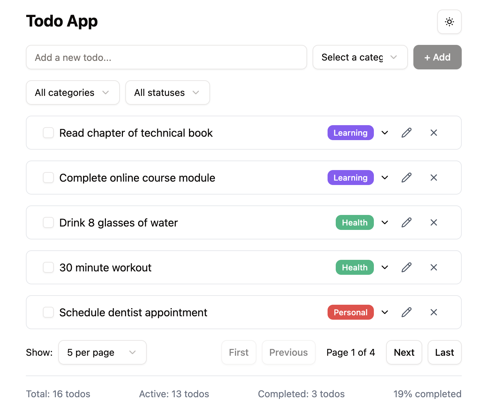

# Todo App with shadcn, Redux Toolkit, and React

This exercise demonstrates the integration of React tools and libraries to build a todo application. The project combines the power of shadcn/ui for beautiful components, Redux Toolkit for state management, and React for the user interface.

## Technologies Used

- React
- Redux Toolkit (RTK)
- shadcn/ui
- TypeScript
- Tailwind CSS

## Features

- Create, read, update, and delete todos
- Modern and responsive UI using shadcn components
- Centralized state management with Redux Toolkit
- Type-safe development with TypeScript
- Styled with Tailwind CSS

## Project Structure

- `/src/components` - React components
- `/src/store` - Redux store configuration and slices
- `/src/lib` - Utility functions and shared code
- `/src/types` - TypeScript type definitions

## Learning Objectives

- Working with shadcn/ui components
- Implementing Redux Toolkit for state management
- Building a modern React application
- TypeScript integration
- Tailwind CSS styling
